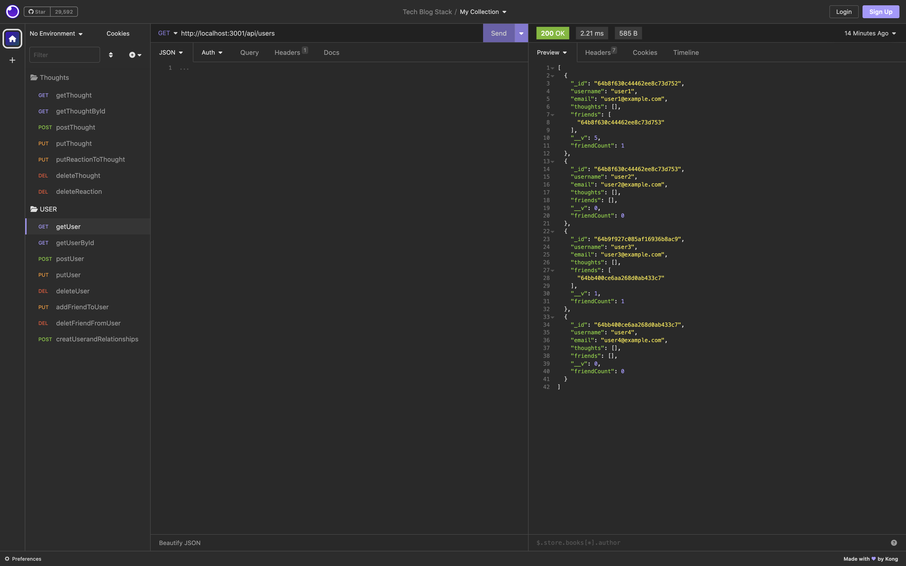

# Social Network API NoSql

 

 To watch a demo of the functionality, [click here](https://drive.google.com/file/d/1ezOmMmTAgaul5OTxX09fgD1rlv0_L3jn/view).


In this project, I developed a dynamic social media API using the NoSQL database MongoDB. The primary goal was to build an API that could handle large amounts of unstructured data, which makes MongoDB an ideal choice for social networking platforms. The API allows users to interact with various endpoints to send payload data or retrieve information from the MongoDB documents.

## Description 

For this project, the objective was to create an API for a social network web application where users can share their thoughts, react to friends' thoughts, and manage their friend lists. The technology stack used includes Express.js for routing, MongoDB as the NoSQL database, and Mongoose as the ODM (Object-Document Mapper). The API provides various routes for users and thoughts, allowing CRUD (Create, Read, Update, Delete) operations.

## Table of Contents

* [Title](#title)
* [Description](#description)
* [Installation](#installation)
* [Usage](#usage)
* [Author](#author)
* [GitHub Link and Demo](#github-link-and-demo)
* [License](#license)

## Installation:

```bash
npm install  "express": "^4.18.2", "moment": "^2.29.4" "mongoose": "^7.4.0", "validator": "^13.9.0"
npm run start
```


## Usage
```
1. install dependencies
2. run "npm run start"
3. Use insomnia or something similar to send requests to the routes
```

###

Written by Christian Alteri

To learn more about my project, [click here](https://github.com/ChristianAlteri/Social-Network-API-NoSql).


####

[](LICENSE)
